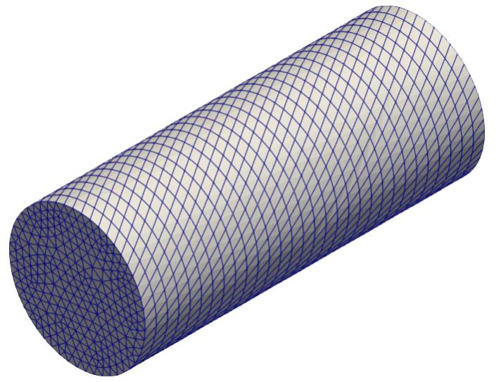
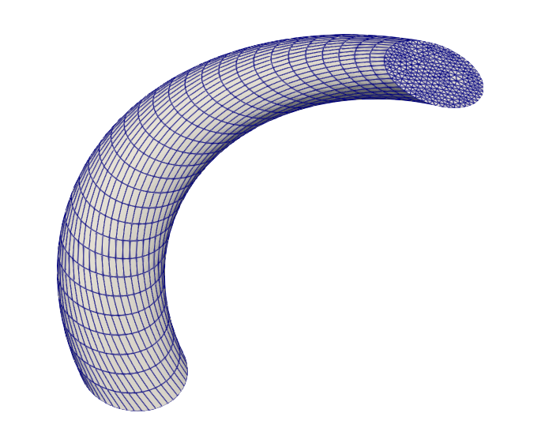

# OF_twistedLinearNormal
## Desrciption
This extrudeModel can be used to create twisted meshes, which may be better to solve highly twisted flow at breathers, pump outlets etc. It also allowed to create helical-like meshes, but with skew distortion.
Model was tested in OF 2306 and OF 11, but it should work in other .com and .org versions as well.

To create meshes it takes:
1. thickness of extrude;
2. totalTwist along extrude;
3. refPoint of twist axis (axis is colinear with normal of extrude surface);

After extrusion (like generic linearNormal), layers are twisted around twist axis. Total twist is equally distributed by layers.

## How to compile
1) Place it wherever you want;
2) Copy the extrudeModel folder from src ($FOAM_SRC/mesh/extrudeModel/extrudeModel/);
3) Run wmake.
In repository the extrudeModel for OpenFOAM 2306 is included, but you SHOULD update it to yours version
  
## How to use
1) In controlDict, add or append the libs line:
libs ("libmyExtrudeModel.so");
2) In extrudeMeshDict, extrudeModel "twistedLinearNormal" is now allowed (see the example);
3) Just use the regular extrudeMesh command.
